<!--
  ════════════════════════════════════════════════════════════════
  AHMED SABRARI · GitHub Profile
  23 animated SVG banners · aurora / cyber aesthetic
  ════════════════════════════════════════════════════════════════
-->

<!-- ═══════════════ HERO ═══════════════ -->


 

<!-- ═══════════════ DASHBOARD ═══════════════ -->

 

 
 

 

<!-- ═══════════════ WORK ═══════════════ -->
 

 
 

 

<!-- ═══════════════ ACTIVITY ═══════════════ -->
 

 
 

 
 

 

<!-- ═══════════════ STACK ═══════════════ -->
 

 
 

 

<!-- ═══════════════ HEATMAP + SNAKE ═══════════════ -->
 

 
 

 

<!-- ═══════════════ FOOTER ═══════════════ -->

<!-- 

  

  

  

  

  

  

  

  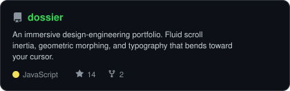

  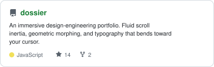

  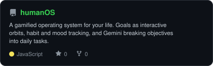

  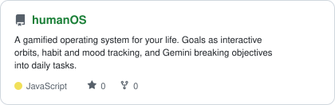

  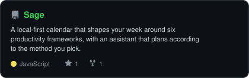

  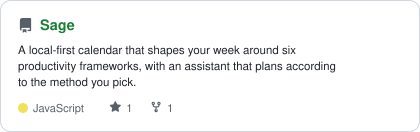

  

  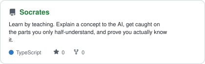

  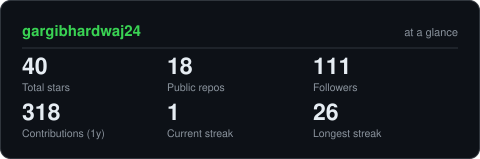

  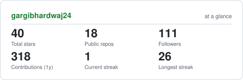

  

  

  

  

  

  

  

  

  

  

 -->
